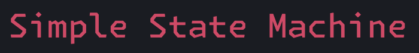
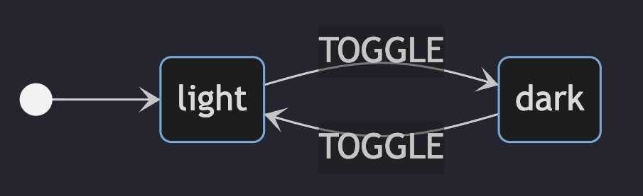

<p align='center'>
   
</p>

 🚧**Note: Work is in progress to improve test coverage and documentation**🚧

- Simple State Machine is a typescript library that aims to make coding state machines simple, type-safe and fun. 
- If you are new to state machines, I would recommend to go through [statecharts.dev](https://statecharts.dev/what-is-a-state-machine.html). Its an amazing design pattern that helps developer to think about UI State problems with a new mental model. 

## Packages
- Core - [`@simple-state-machine/core`](./packages/core/)
- React - [`@simple-state-machine/react`](./packages/react/)

## Quick glance
- A simplest state machine can be a "Light<>Dark" Mode toggling. On click of button is toggle from `light` to `dark` or vice versa.
- State diagram looks something like this for it: 
- Code for the above machine using the library looks like
   ```js
      import {createState, createEvents, createContext, MachineConfig, interpret} from 'simple-state-machine'

      const states = createStates('light', 'dark');
      const events = createEvents('TOGGLE');
      const context = createContext({});

      const ThemeMachine = new MachineConfig(states, context, events);
      const {whenIn} = ThemeMachine
      
      whenIn('light').on('TOGGLE').moveTo('dark');
      whenIn('dark').on('TOGGLE').moveTo('light');

      const {send, subscribe, start} = interpret(ThemeMachine)
      
      // toggle on button click
      document.querySelector('.toggle-btn').addEventListener('click', () => send('TOGGLE'));

      // subscribe to updates
      machine.subscribe((state) => {
         document.body.className = state.value === 'light' ? 'light-mode' : 'dark-mode'
      })

      // start the machine
      start()
   ```
- Enough talk, show me code: [](https://codesandbox.io/p/sandbox/toggle-theme-machine-dyrwzd?file=%2Fsrc%2Findex.mjs%3A25%2C1)
## Examples

- [Toggle Theme Machine](https://codesandbox.io/p/sandbox/toggle-theme-machine-dyrwzd)
- [Throttling Machine](https://codesandbox.io/p/sandbox/throttling-x9mzy5) in typescript
- [Debounce Machine](https://codesandbox.io/p/sandbox/debounce-stg462) in React

## API
- For `core` library API, please look into [core API](./packages/core/docs/api.md)

## Why, How and What ?

- For anyone curious to understand these points 
  - [Why ?](./docs/why.md)
  - How and Whats of implementation => coming soon!

## LICENSE
MIT