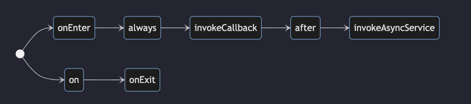

# Life Cycle

- Every State has its own life cycle which again considered as states of a State, but to keep it simple, lets call them stages of lifecycle
-  
  - Life cycle looks like this

- ## onEnter()
  - When state machine enters into a specific state, the first function to be called is `onEnter`
  - onEnter() returns [`updateContext`](api-doc.md/#updatecontext) and [`fireAndForget`](api-doc.md/#fireandforget) functions
  - Usage:
    ```js
        idle.onEnter().updateContext({...}).fireAndForget(doSomeStuff)
    ```

- ## always()
  - Once onEnter function is executed, state machine looks out for the `always` configurations
  - `always` is a function which as the name says, that regardless of what the event is, when the state machine machine, always do this. 
  - `always` method returns the following functions
    - [moveTo](api-doc.md/#moveto)
    - [if](api-doc.md/#moveto)
    - [updateContext](api-doc.md/#updatecontext)
    - [fireAndForget](api-doc.md/#fireandforget)
  - Usage:
    ```js
        idle.always().if(context => context.url === '').moveTo('notifyUser')
    ```

- ## invokeCallback()
  - invokeCallback() method allows the users to register event listeners that have callbacks. For example, mouse events or socket events etc. These are generally asynchronous in nature but use `on`  or `addEventListener` methods.
  - Returns
    - [on](api-doc.md/#on)
  - Usage: 
    ```js
        loading.invokeCallback((context, callback) => {
            const clickListener = () => callback('CLICKED')
            document.addEventListener('click', clickListener)
            return function cleanUp() {
                document.removeEventListener(clickListener)
            }
        }).on('CLICKED').moveTo('someOther')
    ```

- ## after()
  - after() method allows the user to perform actions after a certain amount of time. It behaves like `setTimeout`
  - after() method takes either a number or a function that returns a number. This number generally denotes milliseconds.
  - Returns
    - [moveTo](api-doc.md/#moveto)
    - [if](api-doc.md/#if)
    - [updateContext](api-doc.md/#updatecontext)
    - [fireAndForget](api-doc.md/#fireandforget)
  - Usage:
    ```js
        // after 5 sec or 5000 ms move to idle state
        error.after(5000).moveTo('idle')
        // delay can be set dynamically too
        error.after(context => context.timeout).moveTo('idle')
    ```

- ## invokeAsyncCallback()
  - invokeAsyncCallback() method is similar to `invokeCallback` but allows the user to write asynchronous code in its callback
  - invokeAsyncCallback takes a function as a parameter which has to return a promise
  - Returns
    - [onDone](#ondone)
    - [onError](#onexit)
  - Usage: 
    ```js
        loading
            .invokeAsyncCallback(context => fetch(context.url).then(res => res.json()))
            .onDone()
            .moveTo('idle')
            .updateContext({
                response: (_, event) => event.data.response
            })
    ```
    - ### onDone()
      - onDone function is called to notify the developer that promise has been resolved.
      - Returns
        - [moveTo](api-doc.md/#moveto)
        - [updateContext](api-doc.md/#updatecontext)
        - [fireAndForget](api-doc.md/#fireandforget)
    - ### onError()
      - onError function is called to notify the developer that promise has been rejected
      - Returns
        - [moveTo](api-doc.md/#moveto)
        - [updateContext](api-doc.md/#updatecontext)
        - [fireAndForget](api-doc.md/#fireandforget)

- ## onExit()
  - onExit is the last method of lifecycle that gets called just before transitioning to the next state
  - Returns
    - [updateContext](api-doc.md/#updatecontext)
    - [fireAndForget](api-doc.md#fireandforget)
  - Usage:
    ```js
        error.onExit().fireAndForget(logStateExit)
    ```