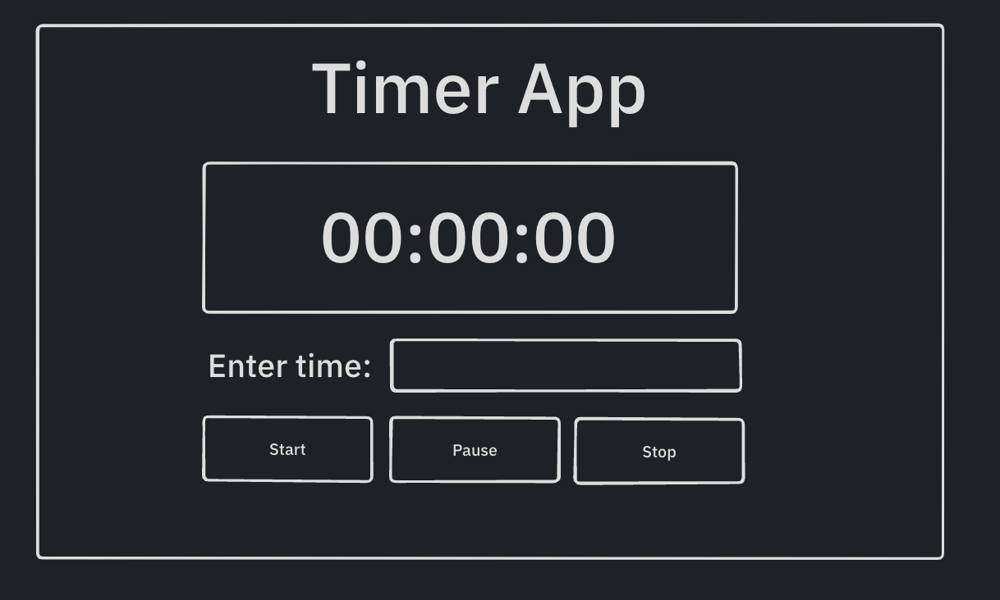

# Tutorial

## Basics


- Lets make a simple timer app in javascript using state machine that looks something like this
- So lets define the states first. There can be 2 states that timer app can be in
  - 1. Idle
  - 2. Running 
- Lets code this
  ```js
    import {createStates} from '@simple-state-machine/core'

    const states = createStates('idle', 'running')
  ```
- There are 3 buttons & one input in the app that emit events. So, there are 4 events that affect the state of the app. Lets name them
  - 1. START
  - 2. PAUSE
  - 3. STOP
  - 4. UPDATE_TIME

- Lets update the code
    ```js
        import {createStates, createEvents} from '@simple-state-machine/core'

        const states = createStates('idle', 'running');
        const events = createEvents('START', 'PAUSE', 'STOP');
    ```
- Now that we have defined our state and events, we need to define the context of the app. Context can be treated as the data that is mutated during the transitions of the states or on receiving the events. In the timer app, the data that gets mutated is the `time`
    ```js
        import {createStates, createEvents, createContext} from '@simple-state-machine/core'

        const states = createStates('idle', 'running');
        const events = createEvents('START', 'PAUSE', 'STOP');
        const context = createContext({time: 0})
    ```
- We have created all our lego blocks that we need to build a state machine, lets go ahead and create machine config 
    ```js
        import {createStates, createEvents, createContext, MachineConfig} from '@simple-state-machine/core'

        const states = createStates('idle', 'running');
        const events = createEvents('START', 'PAUSE', 'STOP');
        const context = createContext({time: 0})

        // create machine config
        const TimerMachineConfig = new MachineConfig(states, context, events)
    ```
- Think of `MachineConfig` as the toolkit which can provide you with all the necessary state machine functions that you need to write your business logic
- Now that we have `TimerMachineConfig`, lets define transitions. 
  - 1. When in `idle` state, on receiving `UPDATE_TIME` event, update the time in the context
  - 2. When in `idle` state, on receiving `START` event, move to `running` state
  - 3. When in `running` state, on receiving `PAUSE` event, move to `idle` state
  - 4. When in `running` state, on receiving `STOP` event, move to `idle` state, and reset the time to `0`
- Lets transform these statements into the code below
    ```js
        // lets get the states first
        const {idle, running} = TimerMachineConfig.getStates()
        
        // lets define transitions
        idle
            .on('UPDATE_TIME')
            .updateContext({time: (_, event) => event.data.time});
        idle
            .on('START')
            .moveTo('running');
        running
            .on('PAUSE')
            .moveTo('idle')
        running
            .on('STOP')
            .moveTo('idle')
            .updateContext({time: 0})
    ```
- At this point, we have handled all the user interactions and most edge cases like
  - 1. What would happen if user updates time while app is in `running` state?
  - 2. Will my app respond to `pause` and `stop` events while in `idle` state?

- There is only one thing left, its that app has to decrement the time after every one second, which is the crux of the app. For this, developer need not go through all the hassle of creating `setInterval` and storing its `id` and then clearing its `id` when user clicks on stop etc. This library handles it all by providing `after` method. 
  ```js
    // after takes time in milliseconds. 1000ms === 1sec
    running
        .after(1000)
        .moveTo('running')
        .updateContext({time: context => context.time - 1})
  ```
- If the above code is confusing, don't worry. We are asking `running` state to start timer for `1000ms` and after that move to the same state by decrementing time. So once the timer of `1000ms` is done, it decrements time by `1` and then goes back to same state and again runs timer and so on..., its basically a loop which can be only broken when user either clicks on either `PAUSE` or `STOP`, which in that case moves to `idle`

- We have configured our `TimerMachineConfig` and we are left with using it in actual app.
- Lets use it in the actual app
  
  ```js
    import {createMachine} from '@simple-state-machine/core'

    const {start, subscribe, send} = createMachine(TimerMachineConfig);

    const startBtn = document.querySelector('.start-btn');
    const pauseBtn = document.querySelector('.pause-btn');
    const stopBtn = document.querySelector('.stop-btn');
    const timerInput = document.querySelector('.timer-input');
    const timerDisplay = document.querySelector('.timer-display')

    startBtn.addEventListener('click', () => send('START'));
    pauseBtn.addEventListener('click', () => send('PAUSE'));
    stopBtn.addEventListener('click', () => send('STOP'));
    timerInput.addEventListener('input', (e) => send({
        type: 'UPDATE_TIME',
        data: {
            time: e.currentTarget.value
        }
    }));

    subscribe('allChanges',(state) => {
        timerDisplay.innerText = state.context.time;
    });

    start();
  ```