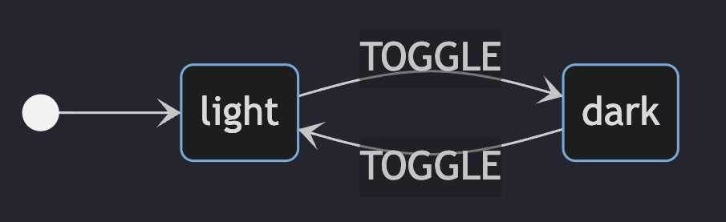

# Simple State Machine

## Installation
```
   npm i @simple-state-machine/core
```
## Quick glance
- A simplest state machine can be a "Light<>Dark" Mode toggling. On click of button is toggle from `light` to `dark` or vice versa.
- State diagram looks something like this for it: 
- Code for the above machine using the library looks like
   ```js
      import {createState, createEvents, createContext, MachineConfig} from 'simple-state-machine'

      const states = createStates('light', 'dark');
      const events = createEvents('TOGGLE');
      const context = createContext({});

      const ThemeMachine = new MachineConfig(states, context, events);
      const {light, dark} = ThemeMachine.getStates();
      
      light.on('TOGGLE').moveTo('dark');
      dark.on('TOGGLE').moveTo('light');
   ```

## Examples

- [Toggle Theme Machine](https://codesandbox.io/p/sandbox/toggle-theme-machine-dyrwzd)
- [Throttling Machine](https://codesandbox.io/p/sandbox/throttling-x9mzy5) in typescript

## API

- [API Documentation](./docs/api.md)